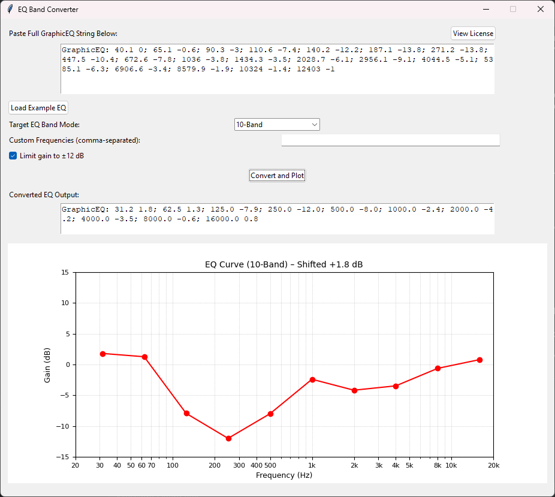

# EQ Band Converter

[](https://opensource.org/licenses/MIT)
[](https://www.python.org)

A tool for converting Equalizer APO configurations between different band formats (10/15/31/custom bands). Designed especially for adapting high-resolution EQ profiles to devices with limited band support (e.g., FiiO BTR13).



## Features

- Convert between standard EQ band formats:
  - 10-band (31Hz - 16kHz)
  - 15-band (25Hz - 16kHz)
  - 31-band (20Hz - 20kHz)
- Support for custom frequency bands
- Automatic gain limiting (±12dB)
- Visual EQ curve plotting
- Preserve original sound characteristics through intelligent interpolation
- Export to Equalizer APO compatible format

## Dependencies
Python 3.11.9  
NumPy 2.2.4  
Matplotlib 3.10.1  
PyInstaller 6.12.0 (for building executables)  
```console
pip install -r requirements.txt
```
## Usage
Paste your existing GraphicEQ string in the input box  
Select target band format (or enter custom frequencies)  
Check "Limit gain" if needed  
Click "Convert and Plot"  
Copy the converted EQ string from the output box  

## Building
(best if you create python venv before build, install all dependencies to virtual environment)  
```console
python -m PyInstaller --onefile --icon=noise-icon.png --clean --noconsole eq-conv.py
```

## License
This project is licensed under the MIT License - see LICENSE.md for details.  
For Third-party licenses - see THIRD_PARTY.md for details.  
Application has built-in licenses information additionally.  
